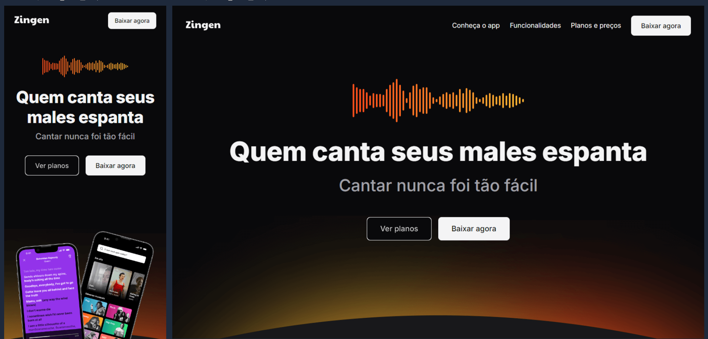

# Zingen 🎵


*Preview da landing page do aplicativo Zingen.*

Projeto desenvolvido como parte do curso **Full-Stack da Rocketseat**, com foco no estudo de **HTML5**, **CSS3** e na construção de **landing pages responsivas**, simulando a apresentação de um produto digital real.

---

## 🚀 Tecnologias Utilizadas
- **HTML5**
- **CSS3**

---

## 🎯 Objetivo do Projeto
O objetivo deste projeto é praticar a construção de uma **landing page responsiva** para um aplicativo, aplicando conceitos de **estrutura semântica**, **CSS moderno** e organização visual voltada para apresentação de produto.

Foram explorados elementos comuns em páginas de marketing, como seções informativas, chamadas para ação (*call to action*), hierarquia visual e adaptação do layout para diferentes tamanhos de tela, buscando uma interface clara, atrativa e profissional.

---

## 📁 Como visualizar o projeto

### 1. Clone o repositório
```bash
git clone https://github.com/muddyorc/zingen.git
